# PID Temperature Control - Ladder Logic Documentation

## Overview
This document describes the **PID-based temperature control system** implemented in RSLogix using Ladder Logic. The system takes an **analog temperature input**, scales it, compares it to set limits, and uses a **PID loop** to regulate the output.

## Ladder Logic Breakdown

### **1. Temperature Scaling (SCP Instruction)**
- **Function:** Converts raw analog input to a usable temperature range.
- **Inputs:**
  - **Raw Input (`I:3.0`)** from an analog temperature sensor.
  - **Min/Max Raw Values:** `0 - 16383`.
  - **Scaled Range:** `32 - 212` (Temperature in Fahrenheit).
- **Output:** Stores the scaled temperature in `N7:0`.

```ladder
SCP Instruction
  Input: I:3.0
  Input Min: 0
  Input Max: 16383
  Scaled Min: 32
  Scaled Max: 212
  Output: N7:0
```

---

### **2. Temperature Comparisons**
#### **Low Temperature Check (LESS THAN - LES Instruction)**
- **Condition:** If `N7:0` (temperature) is **less than** 32°F.
- **Action:** Moves `32` into `N7:0` (ensures minimum threshold).

#### **High Temperature Check (GREATER THAN - GRT Instruction)**
- **Condition:** If `N7:0` (temperature) is **greater than** 212°F.
- **Action:** Moves `212` into `N7:0` (ensures maximum threshold).

---

### **3. PID Control Setup (PD9:0)**
- The **PID instruction** regulates temperature by adjusting the control variable (`CV`) output.

#### **PID Parameters:**
| Parameter        | Value  | Description |
|-----------------|--------|-------------|
| **Set Point (SPS)**  | 72 | Desired Temperature |
| **Max Setpoint**  | 212 | Highest allowable temperature |
| **Min Setpoint**  | 32 | Lowest allowable temperature |
| **Process Variable (PV)**  | N7:0 | Current measured temperature |
| **Control Variable (CV%)** | 0 - 100% | PID Output for controlling heating or cooling |

#### **Tuning Parameters:**
| Parameter        | Value  | Description |
|-----------------|--------|-------------|
| **Gain (Kc)**  | 0.0  | Proportional Gain (Requires tuning) |
| **Reset (Ti)** | 0.0  | Integral time constant (Requires tuning) |
| **Rate (Td)**  | 0.0  | Derivative time constant (Requires tuning) |
| **PID Control Mode** | AUTO  | Automatically adjusts based on error |
| **Time Mode** | TIMED  | Updates control at regular intervals |

#### **PID Output:**
- The PID **calculates an output** based on the temperature difference.
- The **control output (CV%)** determines the level of heating or cooling applied.

```ladder
PID Instruction
  PID File: PD9:0
  Process Variable: N7:0
  Control Variable: N7:1
  Setpoint: 72
```

---

### **4. Temperature Controller Output**
- **Final Output:**
  - Moves the PID output (`N7:1`) to the actual control device (`O:4.0`).
  - This output **adjusts the heater or cooler** to maintain the temperature.

```ladder
MOV Instruction
  Source: N7:1
  Destination: O:4.0
```

---

## **Flowchart Representation (Graphviz DOT Code)**

```dot
digraph PID_TemperatureControl {
    rankdir=TB;
    node [shape=rectangle, style=filled, fillcolor=lightblue];

    Start [label="Start Execution", shape=oval, fillcolor=yellow];
    ReadTemperature [label="Read Analog Input (I:3.0)"];
    ScaleTemperature [label="Scale Input to 32-212°F (SCP)"];
    CheckLow [label="Temperature < 32°F?"];
    CheckHigh [label="Temperature > 212°F?"];
    SetLow [label="Set Temp = 32°F"];
    SetHigh [label="Set Temp = 212°F"];
    ComputePID [label="Compute PID Control Output"];
    ApplyOutput [label="Apply Output to Heating/Cooling (O:4.0)"];
    End [label="End Execution", shape=oval, fillcolor=yellow];

    Start -> ReadTemperature -> ScaleTemperature;
    ScaleTemperature -> CheckLow;
    CheckLow -> SetLow [label="Yes"];
    CheckLow -> CheckHigh [label="No"];
    CheckHigh -> SetHigh [label="Yes"];
    CheckHigh -> ComputePID [label="No"];
    SetLow -> ComputePID;
    SetHigh -> ComputePID;
    ComputePID -> ApplyOutput;
    ApplyOutput -> End;
}
```



---

## Summary
- **Temperature input** is read and scaled for control.
- **Setpoint comparisons** ensure the values stay within safe limits.
- **PID logic automatically adjusts heating/cooling** to maintain the desired temperature.
- **Final MOV instruction sends control signals** to the actuator.

This ladder logic ensures a stable and **automated temperature regulation system** using PID control.

---

You can now **upload this `.md` file to GitHub** as project documentation. Let me know if you need a **rendered flowchart image!** 🚀
